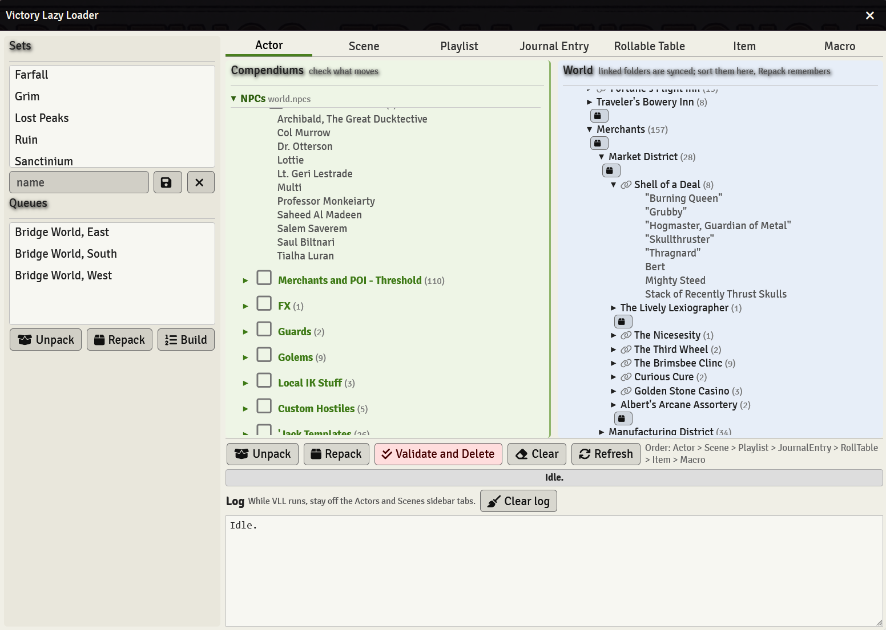
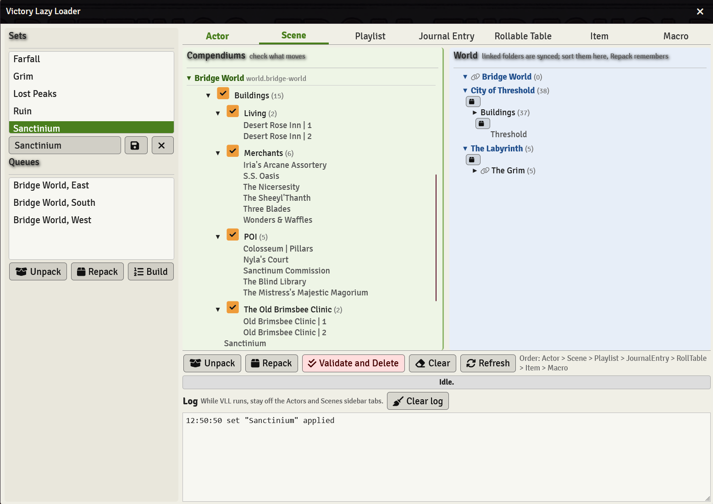
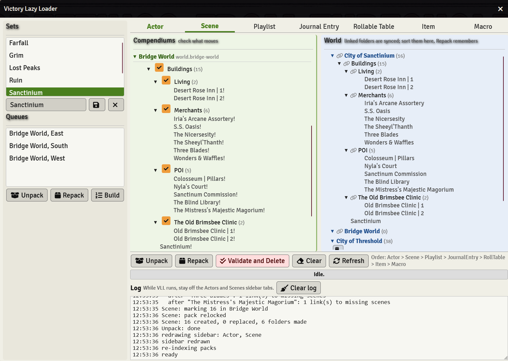

  <i>♫ I like big worlds and I cannot lie, 
  You other GM's can't deny, 
  That when a big ass map with a itty bitty load time 
  and a massive story time lands in your face 
  You roll nat twenties against your crew just for fun! ♫</i>

# Victory Lazy Loader

Big worlds load slow. Every actor, scene, and journal in the sidebar rides along on every connect, and the player on the laptop that wheezes pays for the whole campaign, not just tonight's session. Victory Lazy Loader keeps the world down to the region in play and parks the rest in compendiums until it is needed.

# What is Victory Lazy Loader?

A loader window over the compendium sidebar. Check the compendium folders you want, hit Unpack, and they land in the world with their subfolders, documents, and ids intact. Hit Repack and the world copies go home to the compendium, wherever you sorted them in the meantime. Validate and Delete then clears the world copies, but only the ones whose compendium copy is newer and unmarked, so nothing edited since the unpack ever gets thrown away.

Two verbs and a cleanup. It started life as four macros.

## Install

Paste this into Foundry's Install Module manifest field:

https://github.com/DatJavaClass/VictoryLazyLoader/releases/latest/download/module.json

Enable it in your world. GM only. Foundry v12, verified on 12.343.

## The window

Open **Compendiums > Lazy Loader**. Seven tabs, one per document type, in the order they run: Actor, Scene, Playlist, Journal Entry, Rollable Table, Item, Macro. Actors go before scenes on purpose, so tokens find their actors. Validate and Delete runs the same list backward.

The left pane is your compendiums. Checking a folder takes its whole subtree, and unchecking clears the parents too, so a partial pick stays honest. The right pane is the world, display only. A link icon means that folder is synced with a compendium copy. A small box button means it is not, and clicking it adopts the folder into a compendium of your choice.

Sort world folders in Foundry's own sidebar. Repack remembers where each folder sat, and the next Unpack puts it back there. Unpack never moves a folder that already exists. A folder Repack has never seen lands under a copy of its own compendium path, compendium name on top, so two compendiums that both hold a Harbor folder give you NPCs/Harbor and Actors/Harbor instead of two Harbors stacked at Root. The world setting Mirror compendium layout at Root turns that off for the old flat landing.

## Sets and queues

A set is a saved checklist with a name. Pick one in the rail and the tree checks itself. A queue is an ordered list of sets, put together in the Build window, and it runs front to back with one confirm. Both live in the world, so every GM shares them.

## What a run looks like

Every write holds the sidebar redraw until the end, so a 64 actor, 15 scene unpack does not stall the client once per document. The bar in the footer and Foundry's own progress bar both show the job, and the log names every step, so if it ever stops you know where. Stay off the Actors and Scenes tabs while it runs. The log will remind you.

## Buttons

| Button | Does |
| --- | --- |
| Unpack | Compendium copies into the world; the compendium copies get a trailing ! as the mark |
| Repack | World copies home to the compendium, mark removed, placement remembered |
| Validate and Delete | Removes world copies whose compendium copy is newer and unmarked |
| Clear | Unchecks everything |
| Refresh | Rebuilds both trees |
| Save and Forget | The set under the rail's name box |
| Build | Opens the queue builder |

## Settings

Two world settings, both on by default: relock compendiums after a write, and Mirror compendium layout at Root.

## API

`game.modules.get('victory-lazy-loader').api` exposes `runSet`, `runQueue`, `swap(out, in)`, `unpack`, `repack`, `validate`, `sets`, `queues`, `list`, and `LOG`, with hooks `vll.ready`, `vll.done`, and `vll.queueDone`. `load` and `export` still answer as aliases from 1.x.

AI was used to assist in the refactoring and streamlining of the module from its original macro form.
